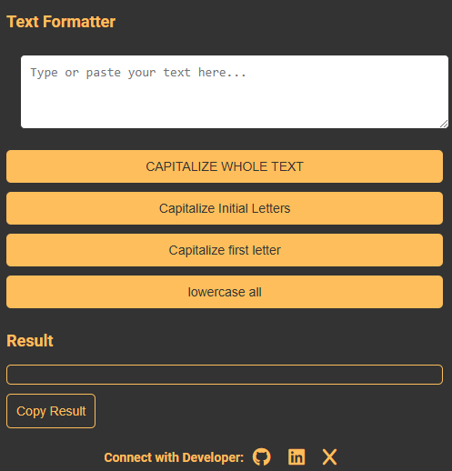
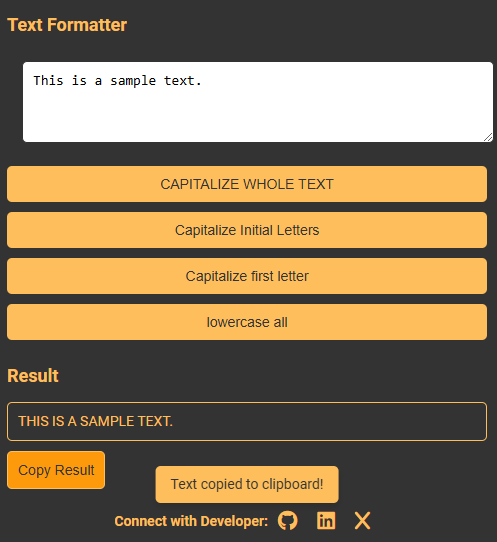

# 🆎 Text Formatter Chrome Extension 🔤
A minimalist Chrome extension to format text effortlessly. Transform text into different cases (UPPERCASE, lowercase, etc.) and copy the results directly from the popup.
## Features
- __CAPITALIZE WHOLE TEXT:__ Convert the entire text to uppercase.
- __Capitalize Initial Letters:__ Capitalize the first letter of each word.
- __Capitalize first letter:__ Capitalize only the first letter of the text.
- __lowercase all letters:__ Convert the entire text to lowercase.
- __Copy Result:__ Copy the transformed text to the clipboard with a single click.


## Installation 📥
1. Clone this repository to your local machine:
```bash
git clone https://github.com/abdullahkalim21/text-formatter.git
```
2. Load Extension in Chrome
- Open Chrome and navigate to `chrome://extensions/`.
3. Enable __Developer mode__ (toggle in the upper right corner).
4. Click `Load unpacked` and select the folder where you cloned this repository.

## Usage
1. Click on the Text Formatter icon in the Chrome toolbar to open the popup.
2. Type or paste text into the input field.
3. Choose a transformation option:
__- CAPITALIZE WHOLE TEXT__
__- Capitalize Initial Letters__
__- Capitalize first letter__
__- lowercase all letters__

4. View the result in the output box.
5. Click Copy Result to copy the transformed text to the clipboard.
6. A notification will appear confirming the text has been copied.

---
## Preview
### User Interface


### Sample Text Formatting


### Copy Resultant Text
